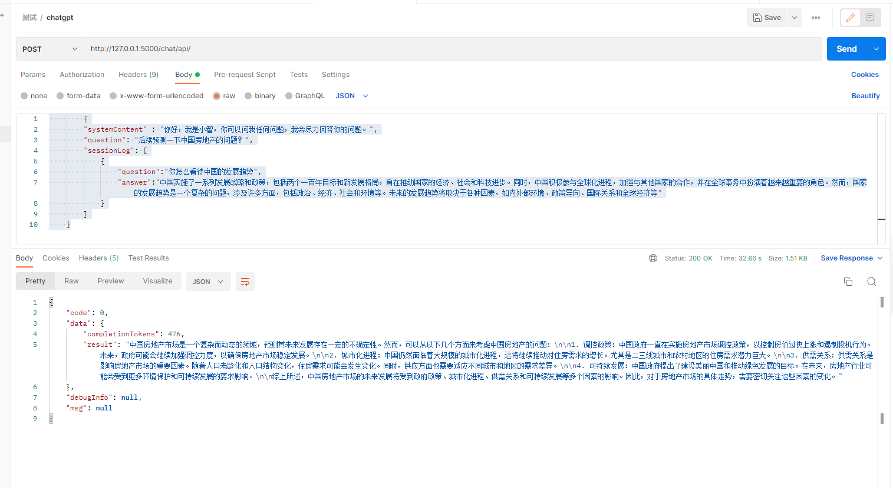

# chatgpt-api

ChatGPT的Api接口，提供访问接口

## 访问接口
请求地址：http://127.0.0.1:5000/chat/api/

请求方式：POST

参数：

```json

        {
        "systemContent" : "你好，我是小智，你可以问我任何问题，我会尽力回答你的问题。",
        "question": "后续预测一下中国房地产的问题？",
        "sessionLog": [
            {
                "question":"你怎么看待中国的发展趋势",
                "answer":"中国实施了一系列发展战略和政策，包括两个一百年目标和新发展格局，旨在推动国家的经济、社会和科技进步。同时，中国积极参与全球化进程，加强与其他国家的合作，并在全球事务中扮演着越来越重要的角色。然而，国家的发展趋势是一个复杂的问题，涉及许多方面，包括政治、经济、社会和环境等。未来的发展趋势将取决于各种因素，如内外部环境、政策导向、国际关系和全球经济等"
            }
        ]
    }
```


